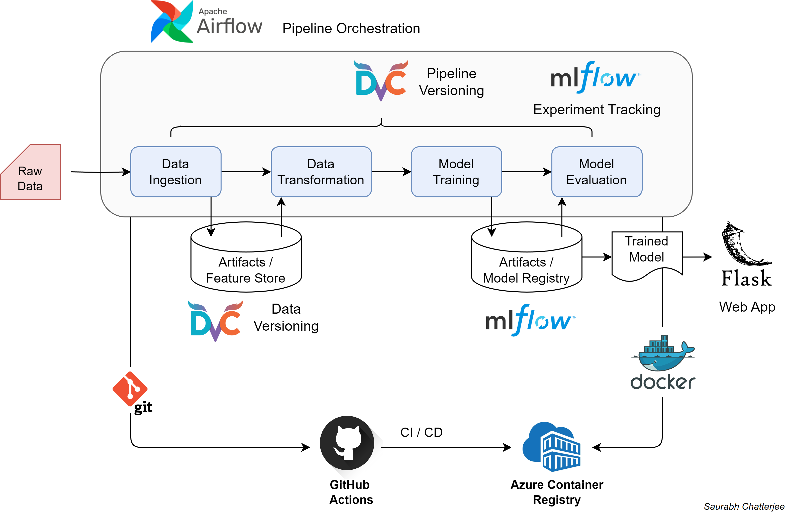

# End-to-End Machine Learning Pipeline Project

An *end-to-end* machine learning project on *Gemstone Price Prediction* with **MLflow**, **DVC**, **Airflow**, **Docker**, **Flask** and **Azure ACR**.

## Problem Statement
You are hired by Gem Stones Co. Ltd, a cubic zirconia manufacturer, to predict the prices of stones based on a dataset of 27,000 samples. The company aims to identify higher and lower profitable stones to optimize its profit share. Your task is to develop a model that predicts stone prices and determine the top 5 most important attributes for accurate predictions.

## Objective
Build an end-to-end solution pipeline which can retrieve raw data, automatically apply data transformation and train machine learning models. Automated evaluation and deployment of the model and pipeline to cloud.

## Dataset
The data has been is taken from [Kaggle](https://www.kaggle.com/competitions/playground-series-s3e8/data). Over 1,93,573 data points are present with following features: Carat, Cut, Color, Clarity, Depth, Table, x, y, z and Price. 

## Tools & Technologies
- Language - [**Python**](https://www.python.org)
- Data and pipeline versioning - [**DVC**](https://dvc.org/)
- Experiment tracking and model management - [**MLflow**](https://mlflow.org)
- Pipeline Orchestration - [**Apache Airflow**](https://airflow.apache.org/)
- Web application - [**Flask**](https://flask.palletsprojects.com/en/3.0.x/)
- Containerization - [**Docker**](https://www.docker.com)
- CI/CD - [**GitHub Actions**](https://github.com/features/actions)
- Cloud container - [**Azure Container Registry**](https://azure.microsoft.com/en-in/products/container-registry)

## Architecture
<div align="center">
  <br>
  <em>Pipeline architecture</em>
</div>

## Exploratory Data Analysis
The exploratory data analysis and modeling is done in the [experiments.ipynb](notebooks/experiments.ipynb) notebook.

## Experiment Tracking
<div align="center">
  <br>
  <em>Model experiment tracking using MLflow</em>
</div>

## Setup

<!-- ### Create project template hierarchy
```bash
python template.py
``` -->

### Setup development environment
```bash
bash init_setup.sh
```

### Acivate environment
```bash
source activate ./env
```

### Install project as local package
```bash
python setup.py install
```

### Run complete pipeline with DVC versioning
```bash
dvc repro
```

### MLflow experiment tracking
```bash
mlflow ui
```

### Pushing project docker image to Azure Container Registry
```bash
docker build -t <registry_name>.azurecr.io/<image_name>:latest
docker login <registry_name>.azurecr.io
username <user_name>
password <password>
docker push <registry_name>.azurecr.io/<image_name>:latest
```

### Run Airflow
- First create `/airflow/dags/` folder and add your pipeline dag python file.
- Set `/airflow` folder as default home for Airflow by adding this environment variable in `.env` file: `AIRFLOW_HOME = /airflow`.

```bash
airflow init db
airflow user create -e <email> -f <first_name> -l <last_name> -p <password> -u <username> -r admin
nohup airflow scheduler & airflow webserver
```


## Contributions
[Saurabh Chatterjee](https://github.com/chatterjeesaurabh) </br>
MTech, Signal Processing and Machine Learning </br>
Indian Institute of Technology (IIT) Kharagpur
